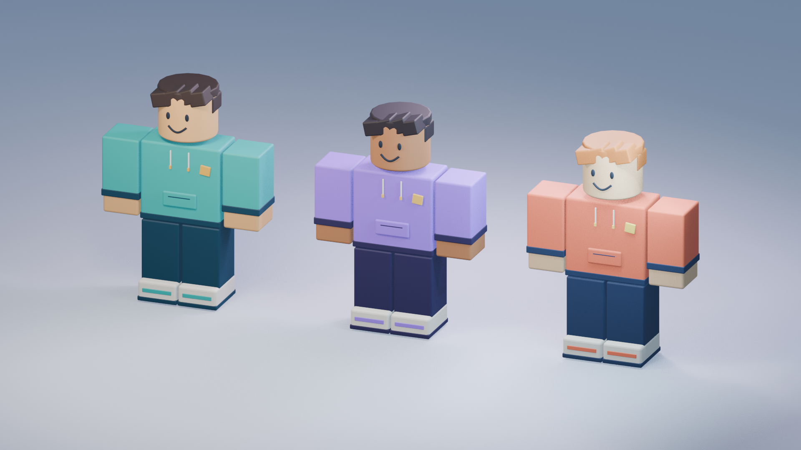

# Roblox Shorts Studio

Everything needed to make original Roblox-style block-character comedy Shorts for TikTok and YouTube Shorts: the character rig and library, the scene and render tools, narration and word-timing helpers, sound library, captions, final encoding, publishing, and two complete worked examples.

<p align="center"></p>

## The pipeline

```
idea → story + script → local Qwen3-TTS narration (cloned George) → measured word timings
     → Blender scene (baked, packed, no local render) → GarageFarm test → full farm render
     → SFX + music + word-highlight captions → verified 1080×1920 MP4 → (publish on request)
```

| Step | Tool |
|---|---|
| Scaffold a project | `python scripts/studio.py new --out projects/<slug> --title "<Title>" --character Max` |
| Narration (default) | `~/Qwen3-TTS/tts.bat --file projects/<slug>/script.txt --clone george --join -o projects/<slug>/audio/qwen` (see references/voice-and-audio.md) |
| Narration (legacy ElevenLabs API) | `python scripts/voice.py generate projects/<slug>` |
| Word timings | `python scripts/studio.py transcribe projects/<slug>` |
| Build the scene | `python scripts/studio.py build projects/<slug>` (background Blender, no render) |
| Render | GarageFarm; see [references/garagefarm.md](references/garagefarm.md) |
| Mix + captions | `python scripts/studio.py finish projects/<slug>` |
| Final MP4 | `python scripts/studio.py finish projects/<slug> --encode` |
| Review sheet | `python scripts/review/contact_sheet.py --frames <pngs> --out sheet.jpg` |
| YouTube upload | `python scripts/youtube_upload.py …` (only on request) |

Run the scripts with Blender's bundled Python, which already has numpy:
`"C:\Program Files\Blender Foundation\Blender 5.2\5.2\python\bin\python.exe"`.

## Using it with Claude

`SKILL.md` is a Claude Code skill. To install it, link or copy this folder to `~/.claude/skills/roblox-shorts-studio`. Then ask, for example:

> Use roblox-shorts-studio to make a 64-second TikTok about Leo getting admin commands for one round. Use my saved George narrator, captions and sound effects, and render on GarageFarm.

## Setup (once per machine)

1. Install Blender 5.2.1 and FFmpeg, plus faster-whisper in its own Python environment for word timings.
2. Copy `config/settings.example.json` to `~/.roblox-shorts-studio/settings.json` and fill in the paths. Keys and tokens never go in files: use the OS keyring or environment variables.
3. Sign in to ElevenLabs and GarageFarm in your browser (Brave). Install renderBeamer for downloading frames.

## Folder map

| Path | What |
|---|---|
| `SKILL.md` | the workflow and hard rules (read first) |
| `references/` | `workflow.md` (end to end), `authoring.md` (rig), `garagefarm.md`, `voice-and-audio.md`, `captions.md`, `publishing.md` |
| `assets/Block_Characters.blend` | Max, Mia and Leo: 7-bone rigid rig, 6 expressions, 8 motion clips each |
| `assets/audio/` | music bed and SFX library (see `PROVENANCE.md`) |
| `assets/fonts/` | Luckiest Guy caption font (OFL) |
| `scripts/` | `studio.py` entry point, `characters.py` rig helpers, render/export/validate, `finish.py`, `transcribe.py`, `voice.py`, `youtube_upload.py` |
| `demo/` | 8 s motion test (`Meet_Max.mp4`) and its editable scene |
| `examples/the-free-coin-trap/` | finished 21.7 s short, including its MP4 |
| `examples/the-afk-champion/` | 64.5 s TikTok short with 5 disaster rounds, HUD and spliced narration |
| `ideas/idea-ledger.json` | idea and status tracker |
| `config/settings.example.json` | tool paths, voice and render preferences |

Farm PNG renders are gigabytes, so they stay out of git (`renders/` is ignored). Download them from GarageFarm into a project's `renders/farm/` when you need to re-encode.
